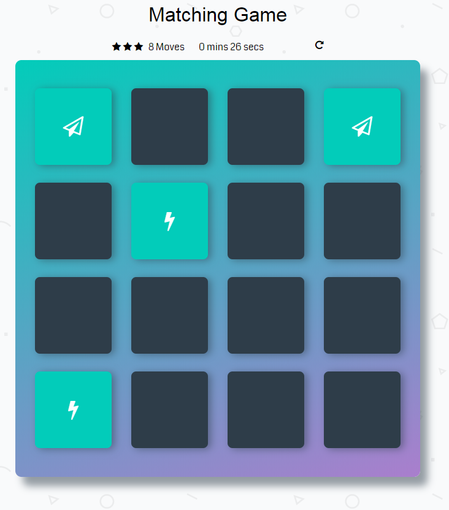
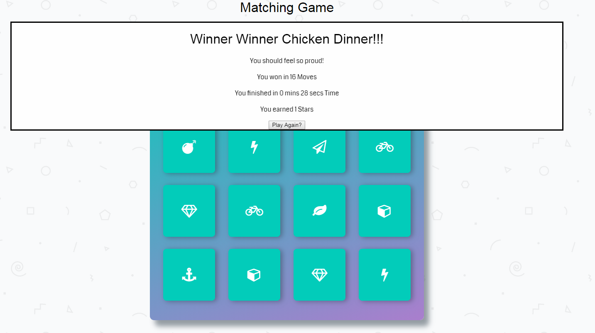

# Memory Game Project
Memory Game made with HTML/CSS/ and vanilla Javascript for Udacity program. 

View live project here https://sgs006.github.io/udacity-memory-game/

## Functionality
* Times your game, gives a star rating, and keeps track of how many turns you take. 

* Congratulations modal pops up on sussesful completion of game. 

* Ability to flip two cards at a time, and restart game at any point. 

## How to Play:

* The goal is to match all the cards together and win the game.

1. Start by clicking on two cards, if they match, look for another pair of cards. If cards are not a pair, try again.

2. Keep matching up pairs until all cards are matched and faced up. 

3. Congratulations, you win! A window appears to tell you your score, time, and moves it took to complete the game. 

## Authors
Sam Stokes - Javascript, HTML for modal

Udacity - HTML/CSS [Starter Code Here] (https://github.com/udacity/fend-project-memory-game)

# Dependencies 
Font-Awesome

Google Fonts - Coda

## License
Free Use

